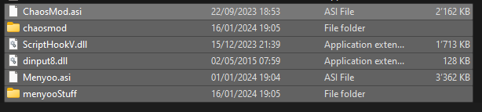

# ChaosMod lienziii

## Installation
1. Die Files von den Ordner ```ChaosMod```, ```ScriptHookV``` und optional ```Meynoo``` in die Gamelocation.

2. Im Ordner ```chaosmod``` die datei ```ChaosModVConfig.exe``` starten und in den Tab Voting -> Twitch  wechseln und OAuth Token rein kopieren (code gibts bei https://twitchapps.com/tmi/) und speichern.
3. GTA V Story starten

## Steuerung
1. STRG + L ChaosMod aktivieren bzw. deaktivieren
2. F9 für Modmenu, ...

## Aufräumen
1. Ins GTA V Verzeichnis gehen
2. Folgende Files löschen (Menyoo optional falls es auch mit installiert wurde)
