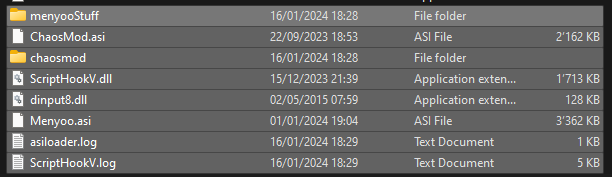

# ChaosMod lienziii

## Installation
1. Auf der Weboberfläche von GitHub auf den grünen Knopf ```<>Code``` klicken und die Option ```Download ZIP``` wählen
2. Die Files/Ordner im Ordner ```files``` in die Gamelocation kopieren.</br>

1. Im Ordner ```chaosmod``` die Datei ```ChaosModVConfig.exe``` starten und in den Tab Voting -> Twitch  wechseln und OAuth Token rein kopieren (OAuth Token gibts bei https://twitchapps.com/tmi/) und speichern.
2. Optional: Falls nicht bereits geschehen muss noch ein 100% save game installiert werden. Dazu die .bak-Files im Ordner ```100%_save``` in den Ordner ```C:\Users\%USER%\Documents\Rockstar Games\GTA V\Profiles\B39B8C2D``` (default) kopieren
3. GTA V Story starten

## Steuerung
1. STRG + L ChaosMod aktivieren bzw. deaktivieren
2. F9 für Modmenu, ...

## Aufräumen
1. In die Gamelocation wechseln
2. Folgende Files löschen</br>
